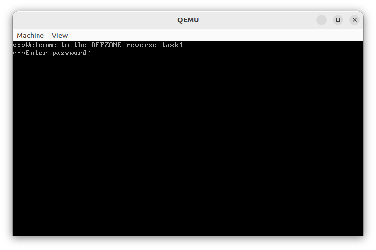
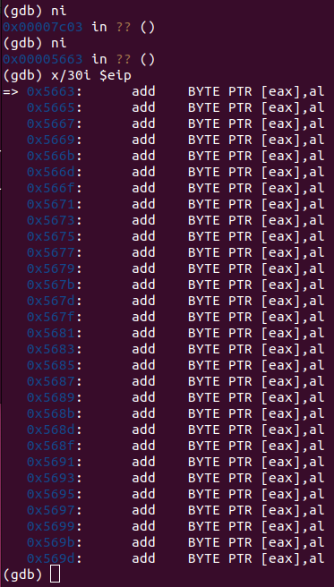
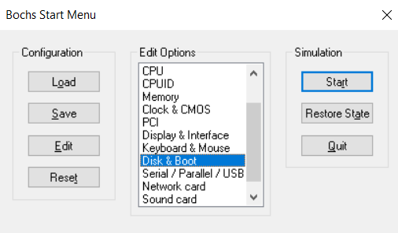
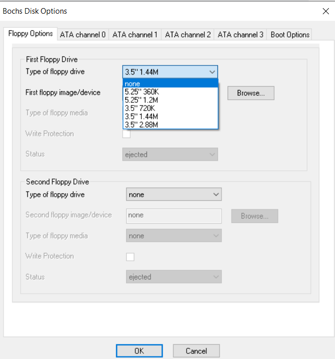
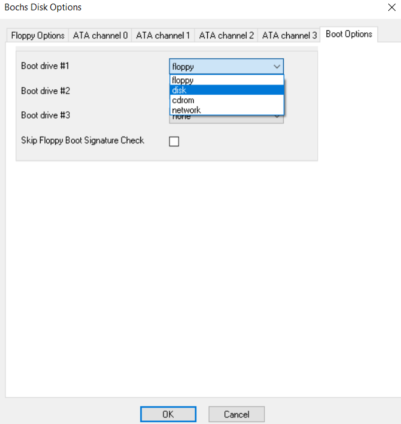
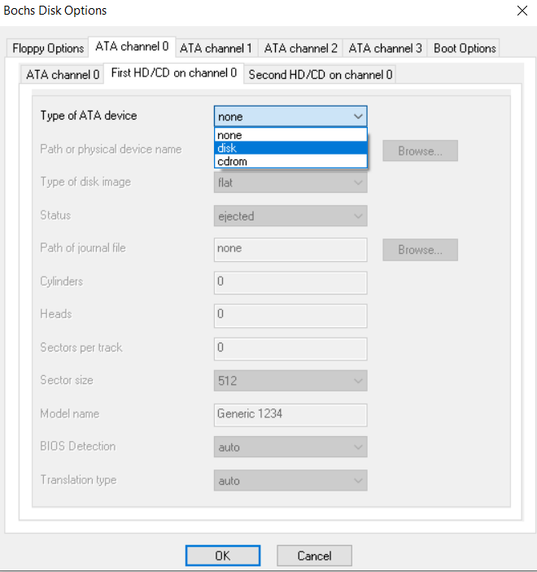
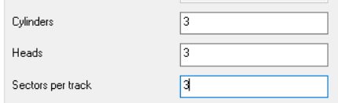
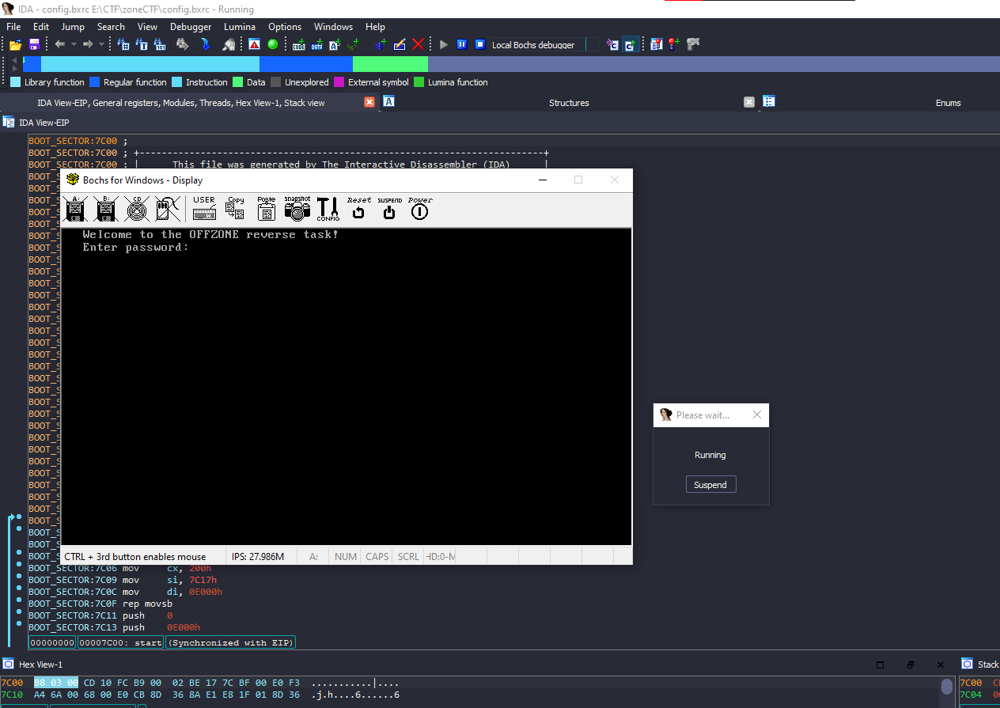
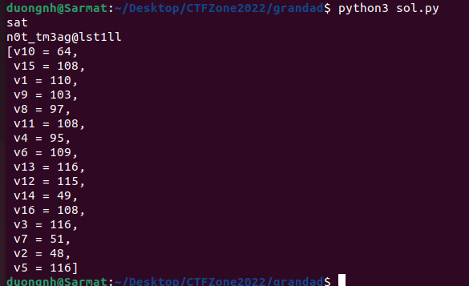
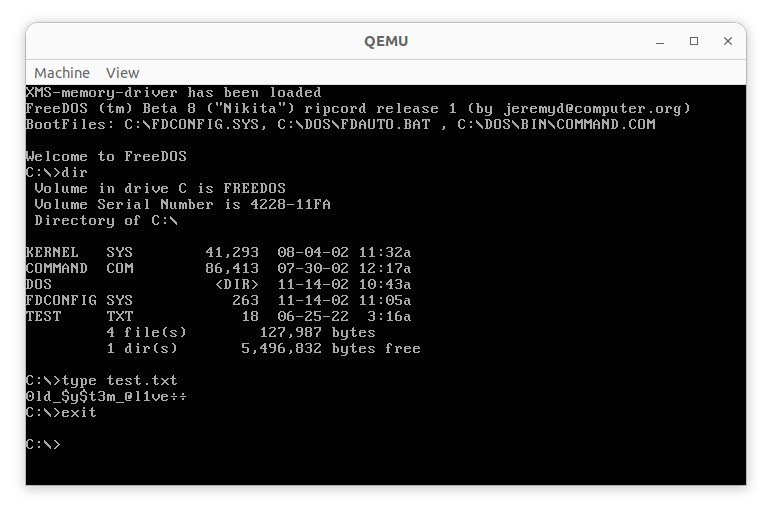

* content
{:toc}

Lần đầu reverse mbr/dos image, setup debug với bochs và IDA


## Challenge Grandad's Magic

Vừa bắt đầu thì mình disassemble file với IDA như thường lệ, nhưng vì đây là lần đầu reverse bootloader, nên mình không nhận ra hàm sub_151 và sub_177 là các hàm check điều kiện của flag (khá n0n...)

P/s: file challenge mình sẽ gọi là "image"


### Vật lộn với qemu và gdb

Dùng qemu để debug thì ta có được một màn hình chờ như thế này:



Sau khi dùng qemu để emulate image mà đề bài đưa ra thì mình đã thử debug bằng gdb, nhưng thất bại thảm hại :D

Không biết vì lý do gì nhưng debugger pass tất cả các breakpoint mà mình đã set, cho dù là sau khi BIOS đã load MBR vào địa chỉ 0x7c00, nói chung nhìn địa chỉ khá là loạn và cái lệnh jmp nhảy khắp nơi, khiến cho mình cũng không hiểu các instruction đang làm gì luôn 😢



Sau khi thực hiện một loạt instruction như trên, image nhảy thẳng vào prompt để chờ user nhập input, mình không thể debug được, đã thử vô số các cách khác nhau nhưng đều thất bại thảm hại.

Vì vậy mình mò đi tìm cách khác để debug (trong vô vọng)...

### Ánh sáng cuối đường hầm

Sau gần 2 tiếng đồng hồ mở vô số tab trên chrome, lúc này mình vô tình thấy được một vài article và video có liên quan đến debug emulated image và ida bochs file, thì mình đã quyết định thử kết hợp kiến thức từ những article này lại.

Thay vì load trực tiếp image vào IDA, mình đã load image vào Bochs và chỉnh sửa lại config menu của Bochs.



**Tab Floppy Options -> Type of floppy drive -> None**



**Tab Boot options -> Boot drive #1 -> disk**



**Tab ATA channel 0 -> First HD/CD on channel 0**



**Ở phần Path or physical device name bạn chọn Browse và sau đó chọn image cần debug.**

**Sau cùng là chỉnh các option Cylinders, Heads, Sectors per track như hình dưới**



Sau đó export file config này ra ngoài, file config được export sẽ có extension là `.bxrc`

Sau cùng là load file config này vào IDA, IDA sẽ tự nhận diện được đây là file Bochs config, và chạy thử thì:



Đặt breakpoint ở đầu chương trình và step thì ta sẽ đến được phần hàm chính của chương trình:

```
debug002:E000 lea     si, aWelcomeToTheOf_0           ; "\t\t\tWelcome to the OFFZONE reverse ta"...
debug002:E004 call    near ptr unk_E126
debug002:E007 lea     si, aEnterPassword_0            ; "\t\t\tEnter password: "
debug002:E00B call    near ptr unk_E126
debug002:E00E mov     di, 1000h
debug002:E011 call    sub_E114
debug002:E014 mov     di, 1000h
debug002:E017 call    near ptr unk_E13A
debug002:E01A pop     cx
debug002:E01B cmp     cx, 9DE0h
debug002:E01F jnz     loc_E107
debug002:E023 pop     cx
debug002:E024 cmp     cx, 0B3D3h
debug002:E028 jnz     loc_E107
debug002:E02C pop     cx
debug002:E02D cmp     cx, 0CEA7h
debug002:E031 jnz     loc_E107
debug002:E035 pop     cx
debug002:E036 cmp     cx, 8FE2h
debug002:E03A jnz     loc_E107
debug002:E03E mov     di, 1000h
debug002:E041 call    near ptr unk_E160
debug002:E044 pop     cx
debug002:E045 cmp     cx, 30F0h
debug002:E049 jnz     loc_E107
debug002:E04D pop     cx
debug002:E04E cmp     cx, 2B74h
debug002:E052 jnz     loc_E107
debug002:E056 pop     cx
debug002:E057 cmp     cx, 171Ch
debug002:E05B jnz     loc_E107
debug002:E05F pop     cx
debug002:E060 cmp     cx, 31D8h
debug002:E064 jnz     loc_E107
debug002:E068 mov     al, byte_100F
debug002:E06B mov     bl, byte_100E
debug002:E06F cmp     al, bl
debug002:E071 jnz     loc_E107
debug002:E075 mov     al, byte_1001
debug002:E078 cmp     al, 30h ; '0'
debug002:E07A jnz     loc_E107
debug002:E07E mov     bl, byte_1006
debug002:E082 add     al, 3
debug002:E084 cmp     al, bl
debug002:E086 jnz     short loc_E107
debug002:E088 mov     al, byte_1004
debug002:E08B mov     bl, byte_1002
debug002:E08F cmp     al, bl
debug002:E091 jnz     short loc_E107
debug002:E093 mov     al, byte_1005
debug002:E096 dec     al
debug002:E098 mov     bl, byte_100A
debug002:E09C cmp     al, bl
debug002:E09E jnz     short loc_E107
debug002:E0A0 mov     al, byte_1009
debug002:E0A3 cmp     al, bl
debug002:E0A5 jz      short loc_E107
debug002:E0A7 mov     al, byte_100B
debug002:E0AA inc     al
debug002:E0AC mov     bl, byte_100C
debug002:E0B0 cmp     al, bl
debug002:E0B2 jnz     short loc_E107
debug002:E0B4 lea     si, unk_E1DA
debug002:E0B8 call    near ptr unk_E126
debug002:E0BB mov     ah, 2
debug002:E0BD mov     al, 1
debug002:E0BF mov     dl, 80h
debug002:E0C1 mov     dh, 5
debug002:E0C3 mov     ch, 9
debug002:E0C5 mov     cl, 1Eh
debug002:E0C7 lea     bx, unk_F000
debug002:E0CB int     13h                             ; DISK - READ SECTORS INTO MEMORY
debug002:E0CB                                         ; AL = number of sectors to read, CH = track, CL = sector
debug002:E0CB                                         ; DH = head, DL = drive, ES:BX -> buffer to fill
debug002:E0CB                                         ; Return: CF set on error, AH = status, AL = number of sectors read
debug002:E0CD xor     si, si
debug002:E0CF
debug002:E0CF loc_E0CF:                               ; CODE XREF: debug002:E0DB↓j
debug002:E0CF mov     al, [si+1000h]
debug002:E0D3 xor     [si-1000h], al
debug002:E0D7 inc     si
debug002:E0D8 cmp     si, 10h
debug002:E0DB jnz     short loc_E0CF
debug002:E0DD mov     ah, 3
debug002:E0DF mov     al, 1
debug002:E0E1 mov     dl, 80h
debug002:E0E3 mov     dh, 5
debug002:E0E5 mov     ch, 9
debug002:E0E7 mov     cl, 1Eh
debug002:E0E9 lea     bx, unk_F000
debug002:E0ED int     13h
```

Ở đây thì chương trình sau khi đọc password do ta nhập vào sẽ chạy một loạt các biểu thức toán học để kiểm tra, nếu input nhập vào thỏa mãn tất cả các điều kiện ta sẽ login được vào OS. Mình dùng z3 để giải các biểu thức này.



Sau khi nhập password thì ta vào được OS chính và...

